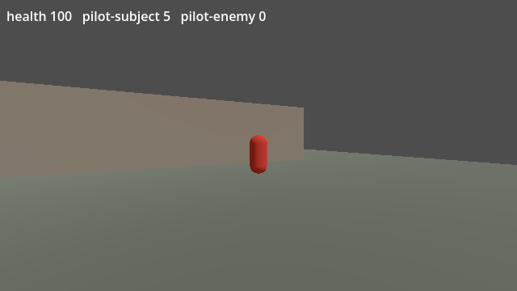
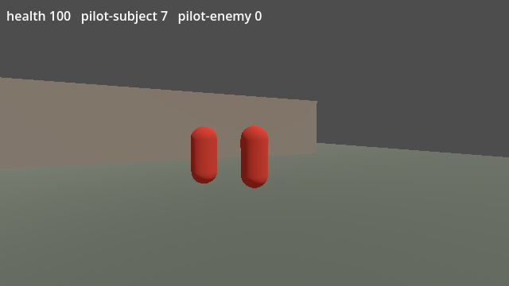

# The live challenge pilot

Until this pilot, fpsdet's active challenges had only run in Python fixtures. The pilot runs them in a real game: a Godot dedicated server and stock clients, on one machine. The whole path runs, and is checked, against one occluded motion replay challenge:

1. the operator plans it with a secret;
2. the server derives its realization and moves the probe;
3. the server proves, moment by moment, that this client could neither see nor hear the probe;
4. a controlled stand-in for a hidden-information reader follows it;
5. fpsdet turns the server's telemetry into evidence;
6. scoring the captured telemetry offline gives the same evidence.

What this is, and is not:

- **It is** a controlled integration qualification: one engine, one small map, scripted players, and stand-ins where a cheat would be.
- **It is not** a deployment, a population, or a detection rate. Its evidence class is `live_controlled_pilot`, kept apart from `controlled_fixture` and `benchmark_v1_real_data`.
- **Nothing in it** touches any other game, anti-cheat, driver or process. Every process is the repository's own Godot project or fpsdet, talking over `127.0.0.1`.

## 1. What the existing integration lacked

The audit found these gaps before anything was built:

| Needed | Before the pilot | Now |
| --- | --- | --- |
| Authoritative visibility query | Docs only: "the server's line-of-sight query". The Unity emitter has no query. | `server.gd` `_vision`: rays from the client's eye to the body against world geometry, every tick (section 6) |
| Authoritative audio query | Docs only. | `server.gd` `_audio`: a server sound event from that body within hearing range, every tick (section 7) |
| Challenge spawn and representation | Requirements in `fpsdet.challenge`, no engine code | The probe in `server.gd`: a replayed route, never a physics body (section 5) |
| `challenge_id`, `challenge_track_ms` | Field definitions; the Unity emitter has neither | Written on every subject event while the window is open |
| Knowledge channel per sample | Only for the event's own enemy. The challenge body's channels came from the plan, not from the server. | `challenge_vision_state` and `challenge_audio_state`: the server's verdict on the body over each event (section 8) |
| Match and player identity, server timestamp | In the emitter | `match_id` from the plan, controlled ids `pilot-subject` and `pilot-enemy`, `t_ms` on the 60 Hz tick |
| Ordinary shot and movement telemetry | In the emitter | Movement every 100 ms; a shot whenever the server accepts one, hit and hitbox by the server's own trace |
| Plan loading | `fpsdet challenge plan` writes the file; nothing read it in a game | `server.gd` `_load_plan`: refuses another game's or match's plan, and any record its secret did not make |
| Server secret handling | Python only (`fpsdet.challenge_plan`) | `recipe.gd`: the same recipe in GDScript, byte for byte. The server reads the secret once, derives, and drops the key. |

The P4 gap this pilot closes:

- **Before:** the body was taken as hidden because the challenge type requires it. A badly placed body could manufacture evidence.
- **Now:** version 2 of `occluded_motion_replay` counts a moment only when the server's own verdict for that moment says vision and audio were absent.
  - One moment where the body was seen or heard voids the challenge.
  - A contradiction voids it too.
  - Version 1 is kept unchanged, so earlier plans and Benchmark v1 reproduce.

## 2. Engine and version

**Godot 4.7.2**, the official build: `4.7.2.stable.official.ed1daf0bf`. Its SHA-512 is pinned in `examples/pilot/qualification.json`, and `pilot.py godot` checks it.

- **Why Godot:** the preferred engines, Unity and Unreal, both require an account to download. Godot is MIT-licensed and downloads without one. It runs a headless dedicated server on Linux, and its high-level multiplayer gives an authoritative server with stock clients in a few hundred lines.
- **Isolation:** the engine is a single portable binary in a folder you choose. Nothing is installed system-wide. Every run points Godot's own user data inside the run folder.

## 3. Setup

```bash
python examples/pilot/pilot.py godot --dest ~/godot-4.7.2                         # download and check the pinned build
python examples/pilot/pilot.py qualify --godot ~/godot-4.7.2/Godot_v4.7.2-stable_linux.x86_64 --out /tmp/pilot
python examples/pilot/pilot.py verify                                             # offline, no engine
```

- `qualify` runs every declared scenario, failure and A/B run; scores, reproduces and leak-checks them; and writes `examples/pilot/result.json` and the capture in `examples/pilot/captured/`. It takes about 8 minutes.
- Drawing clients use `xvfb-run`, so no window opens on anyone's desktop.
- `verify` re-scores the committed capture and compares it with `result.json`. `tests/test_pilot.py` runs it.

## 4. Topology

Three processes on `127.0.0.1`. The server binds the loopback address only.

| Process | What it is |
| --- | --- |
| Server, `--headless` | Authoritative. It simulates both players from their commands at 60 Hz, decides every hit with its own trace, runs the challenge and every knowledge query, and writes the NDJSON. |
| Subject's client | The stock client. It sends move, look and fire; it draws every remote body it is sent. An autopilot plays it, aiming only at bodies it can see. |
| Enemy's client | The stock client. Its avatar is a server-side bot that patrols the open side of the wall. |

The client sends commands only: where to move, where to look, whether to fire. It never reports what it saw, heard, tracked or could know.

In the five scenarios that need a follower, the subject's aim during the window comes from the server's responder (section 9), not from the client.

## 5. The challenge in the game, and the threat model

**The probe** is the realization the secret derives, mapped onto the map:

- `placement_pick` chooses one of six spots behind the wall.
- `route_pick` chooses whose recorded movement it replays (the enemy's).
- `replay_delay_ms` sets how far back that movement is taken from.
- `heading_offset_deg` turns it.
- Its position is clamped to the zone behind the wall.

**What the probe is on the server:** a position and a heading, not a node in the physics world.

- It has no collider, so no player, projectile, trace or move can touch it.
- It has no health, deals no damage, and makes no sound.
- It is in no scoreboard, objective or score.
- The non-interference runs (section 12) show gameplay identical tick for tick with and without it.

**What the subject's client receives:** at 20 Hz, a snapshot entry for the probe with exactly the fields of a real player: a random public entity id, position, yaw, pitch.

- Entries are sorted by id, and nothing marks the probe.
- The stock client draws it like any player. The wall between them hides it: the depth test, not a flag.
- No other client is ever sent it.

**The threat model this establishes:**

- Software reading the subject client's memory or packets has the probe's position, like any player's.
- A person looking at the screen does not: the wall covers it.
- The pilot measures both sides:
  - The client counts every update it received for each entity.
  - Pixel checks confirm the probe changed no pixel while the server called it hidden.
  - In the exposed scenario, the same check shows the client drawing it in the open, and the server calling it seen.
- A server-only probe could not test this, because no client-side reader could react to it.

| The stock client while the follower aims at the probe behind the wall: the probe changed no pixel | The same client when the server was made to place the probe in the open: it is drawn, and the server says seen |
| --- | --- |
|  |  |

**The follower** stands in for such software: a server-side responder that aims the subject at where the probe was 150 ms ago, with a little noise. It is not client code, and nothing in the repository reads another program's memory.

## 6. Vision: what "absent" means here

At every server tick of the window, the server asks one question: from this client's eye, is any part of the probe's body in line of sight? The answer is "absent" only when every ray below is blocked by world geometry.

- **Viewpoint:**
  - The client's eye: its authoritative position plus 1.6 m.
  - Four more points, 0.3 m either side and 0.2 m above and below, so that a client drawing a slightly different eye gains nothing.
- **Target:** the body is a 0.4 m capsule, inflated by 0.25 m. Sixteen points:
  - three heights (0.1, 0.9 and 1.7 m), each at the centre and four points around the inflated radius;
  - the top, at 2.05 m.
- **Time:** the probe's position now, and its position one interpolation delay (100 ms) ago, because the client draws remote bodies that far behind.
- **Occluders:** world geometry only. Players never count as cover.
- **Facing:** not considered. A body behind the client still counts as visible, which is the stricter choice.
- **Cadence:** every tick (60 Hz). An event's verdict is "known" if any tick it covers was known, "unchecked" if any tick was not checked, and "absent" only if every tick was absent.
- **Not modelled:** the pilot draws no shadows, reflections or transparent surfaces. A game that has them must count them as vision too.
- **Cross-checked:** the server's verdict against the client's pixels, in two scenarios. When the server said absent, the probe changed 0 pixels in every check. When it was placed in the open, the server said known and the probe was drawn.

## 7. Audio: what "absent" means here

At every tick, the server asks: did a sound from this body reach this client within the last 500 ms? A sound reaches a client when the server emitted a sound event from that body within 30 m of the client.

- **Remote players make sound only through server sound events:** footsteps above 2 m/s, and gunshots. The client never invents a footstep from movement. So a body the server keeps silent is silent on the client, and the client's own log shows every sound it was sent.
- **The probe emits nothing.** The audio verdict is "absent" because no sound event from it exists, not because one was occluded.
- **Not modelled:** walls do not attenuate sound in this pilot (a sound in range counts as heard), and nearby legitimate sounds do not change the probe's verdict. That is all the audio proof claims. A game with real spatial audio must answer the same question with its own audio model.
- **Exposed audio scenario:** the server deliberately gives the probe footsteps. The verdict turns "known", the challenge abstains, and the subject's client logs the probe's footsteps.

## 8. Telemetry

Every event carries `game_id`, `match_id`, `player_id`, `t_ms` (the match clock: the server tick × 1000/60, rounded) and `map_id`.

- **Movement events,** every 100 ms per player: add `speed_mps`, `on_ground`, `expected_max_ground_speed_mps`.
- **Shot events,** when the server accepts a shot: add `weapon_class`, `weapon_id` and `hit`, and on a hit `hitbox`, `distance_m` and `through_geometry`.
- **The aimed-at real enemy,** when one is in the aim cone: `enemy_id` with the server's `vision_state` and `audio_state` for that enemy, by the same queries.
- **The challenge fields,** on the subject's events while the window is open:

| Field | Meaning |
| --- | --- |
| `challenge_id` | The planned id. Never sent to a client. |
| `challenge_track_ms` | Milliseconds since the previous event that named the challenge that the aim cone held the body: 2° plus the body's own angular radius, counted by server tick. |
| `challenge_vision_state` | The server's vision verdict on the body over the same ticks (section 6). Never about `enemy_id`. |
| `challenge_audio_state` | The same, for audio (section 7). |

Rules for the challenge fields:

- Events at one tick carry one set of challenge fields, so a shot and a movement event at the same moment agree.
- `challenge_vision_state` and `challenge_audio_state` are new in the event schema.
- A player timeline that sets them is digested as `fpsdet.player-events/3`, so `/2` keeps its meaning.

## 9. Scenarios

Declared, with their expected outcomes, in `examples/pilot/qualification.json` before any live run:

| Scenario | What happens | Declared |
| --- | --- | --- |
| honest | The subject aims at and shoots the visible enemy. | not followed, no evidence |
| accidental crossing | The subject spins every 5 s, so the crosshair crosses the probe briefly. | not followed, under the bar |
| exposed vision | The server places the probe in the open, and does not end it. The follower follows. | abstained (seen) |
| exposed audio | The server gives the probe footsteps. The follower follows. | abstained (heard) |
| missing audio channel | The server's audio query is switched off. The follower follows. | abstained (unchecked) |
| contradictory channels | A broken emitter writes two events at one moment that disagree on vision. | abstained (conflict), with a diagnostic |
| visible enemy cover | A bot holds the enemy in the open, in line with the probe. The subject aims at the enemy. | not followed; samples left out as seen |
| illicit follower | The responder follows the probe. | followed: evidence, review |

Failures, each made to happen:

- **On the follower's capture, scored again:**
  - a missing plan, an unknown id, the wrong player, the wrong match, a stale window;
  - duplicated events;
  - malformed channel states.
- **On the server itself, in a server-only run:**
  - no plan;
  - a plan for another match;
  - a record edited and digested again;
  - no secret.

## 10. Results

<!-- pilot:results:begin (generated by fpsdet benchmark report from examples/pilot/result.json; do not edit) -->

**[live controlled pilot]** `examples/pilot/result.json` (`fpsdet.pilot/1`), digest `sha256:ded4a95d8fb9ac2191ef49cce28a15ba96da44f915df9fefad4ea5f24a32d4a7`.

| Scenario | Declared | Observed | Counted moments | Tracked | Left out | Live = offline | Realization | Leaks |
| --- | --- | --- | ---: | ---: | --- | --- | --- | --- |
| honest | not_followed | not_followed | 2 | 117 ms | seen 5 | identical | reproduced | none |
| accidental crossing | not_followed | not_followed | 5 | 100 ms | seen 5 | identical | reproduced | none |
| exposed vision | abstained (seen) | abstained (seen) | 0 | 0 ms | seen 85 | identical | reproduced | none |
| exposed audio | abstained (heard) | abstained (heard) | 2 | 133 ms | heard 94 | identical | reproduced | none |
| missing audio channel | abstained (unchecked) | abstained (unchecked) | 0 | 0 ms | unchecked 88 | identical | reproduced | none |
| contradictory channels | abstained (conflict) | abstained (conflict) | 75 | 7433 ms | conflict 2, seen 10 | identical | reproduced | none |
| visible enemy cover | not_followed | not_followed | 4 | 167 ms | seen 31 | identical | reproduced | none |
| illicit follower | followed | followed, evidence | 80 | 8000 ms | seen 15 | identical | reproduced | none |

| Stock client (subject) | Probe updates received | Probe sounds | Pixel checks with the probe drawn | Probe pixels, most | Enemy's client got the probe |
| --- | ---: | ---: | ---: | ---: | --- |
| honest | 214 | 0 | - | - | no |
| accidental crossing | 163 | 0 | - | - | no |
| exposed vision | 170 | 0 | 4 | 2162 | no |
| exposed audio | 191 | 24 | - | - | no |
| missing audio channel | 176 | 0 | - | - | no |
| contradictory channels | 174 | 0 | - | - | no |
| visible enemy cover | 192 | 0 | - | - | no |
| illicit follower | 190 | 0 | 4 | 0 | no |

Damaged captures of the follower, scored again (none may be stronger than the undamaged capture):

| Damage | Status | Counted | Evidence | Stronger |
| --- | --- | ---: | --- | --- |
| missing plan | unplanned | 0 | no | no |
| unknown challenge id | unplanned | 0 | no | no |
| wrong player | abstained (other_subject) | 0 | no | no |
| wrong match | no_samples | 0 | no | no |
| stale window | no_samples | 0 | no | no |
| duplicate events | followed | 80 | yes | no |
| malformed channel state | followed | 40 | yes | no |

The server's own refusals (a server-only run each):

| Failure | Server | Why | Events naming a challenge |
| --- | --- | --- | ---: |
| missing plan | missing | no challenge plan: no challenge runs in this match | 0 |
| wrong match | refused | the plan is for game fpsdet-godot-pilot match pilot-server-failures, this is fpsdet-godot-pilot pilot-some-other-match: no challenge runs | 0 |
| tampered plan | loaded | the commitment of ch-4db205d36439393fabcb2258 is not what this secret makes | 0 |
| secret unavailable on server | refused | no challenge secret file: no challenge runs | 0 |

Non-interference: 2160 server ticks of the same scripted match with the probe running (670 ticks) and without it. Gameplay digest identical (`580bbf5341c07650…`); mean tick 428.8 µs with, 256.3 µs without.

Timing (illicit follower): server tick 60 Hz, mean 310.8 µs, most 1510 µs; challenge update 114.9 µs and knowledge queries 304.4 µs (161.1 rays) per probe tick; telemetry 23.5 µs per tick, 6544.1 bytes/s; movement events every 100 ms; every t_ms on the tick grid: yes; challenge_track_ms resolution 16.667 ms, emitted 9483.333 ms against the server's 9516.667 ms.

<!-- pilot:results:end -->

## 11. Replay

The capture in `examples/pilot/captured/<scenario>/` is the server's own `events.ndjson`, byte for byte, and the public `plan.json`. To score it:

```bash
fpsdet score examples/pilot/captured/illicit_follower/events.ndjson --profile examples/pilot/pilot.json \
    --challenges examples/pilot/captured/illicit_follower/plan.json --out /tmp/replay
python examples/pilot/pilot.py verify
```

- **What `verify` checks:** each scenario gives the decisions, observation ids, graphs, challenge results and input digests the live run gave. Its packets are the same too, while fpsdet's detector code is the same.
- **When the detector code changes:** the packet digests move with it (they bind it) and are reported, not failed.
- **What it does not need:** the secret. Anyone can check plans, packets and graphs without it.
- **What only the operator can check:** the realization the server ran, with the secret, after the match (`pilot.py` `reproduce`).

## 12. Secret handling

- **Where the secret lives:** `fpsdet challenge keygen` writes it to the run's `private/` folder, mode 600. The server reads it once, derives each realization, and drops the key.
- **What the server keeps private:** after the match it writes what it ran (parameters, placement, source, window and a digest of the path) to `private/`.
- **The post-match check:** `pilot.py` derives the realization again with fpsdet's Python recipe and compares.
- **Leak scan:** every public file of every run — events, plan, server log, client logs, cases, dashboards and screenshots — is scanned byte for byte for:
  - the secret and each realization's material, as raw bytes, hex and base64;
  - any realization field name.
- **Not committed:** nothing from `private/` ever enters the repository.

## 13. Limitations

- **One engine, one map, two players.** The visibility and audio models are this pilot's own (sections 6 and 7). A real game must answer the same questions with its own renderer and audio, and must count shadows, reflections, spectating and team-shared information as channels if the game has them.
- **The follower is a server-side stand-in.** It shows what a reader's aim does to the evidence, not how real software behaves: real readers are not this clean, and challenge-aware ones avoid probes (docs/challenges.md lists what gets through).
- **Scripted players.** Nothing here is a population, a false-positive rate or a calibration. The class is `live_controlled_pilot`, and the benchmark keeps it apart from Benchmark v1's real data.
- **No network adversity.** Loopback only: no packet loss, jitter or real latency.
- **Not measured:** client frame rate under load. The drawing client runs on a software renderer in a virtual display; its frame rate is reported, not representative.
- **Visible-enemy cover gets through,** live as in the controlled scenarios: aim on a visible enemy explains the sample.
