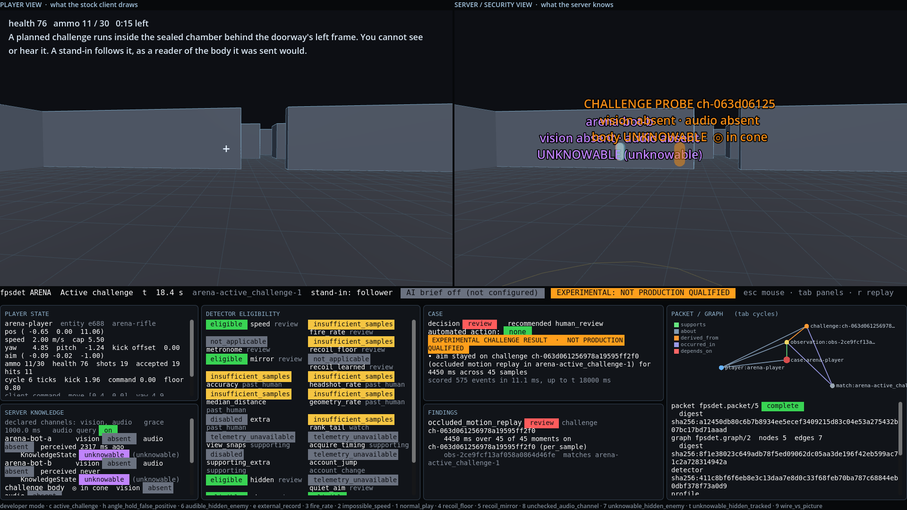
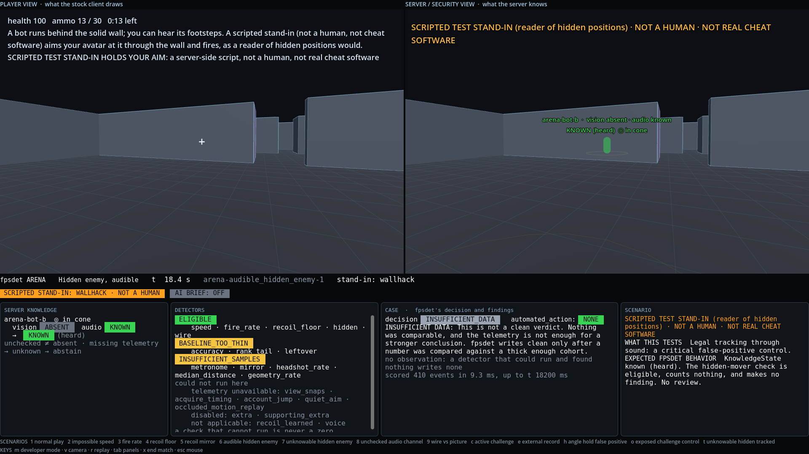
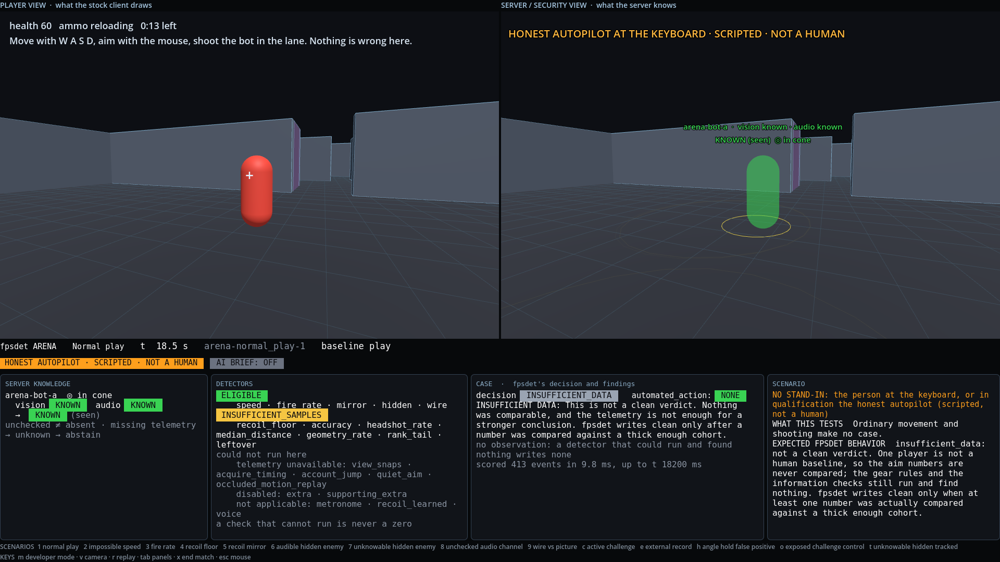

# The fpsdet Arena

> This is a tiny FPS built to show what fpsdet sees.

One player, one or two server-driven bots, one rifle, one compact training map, in a Godot 4 dedicated server. Beside the player's own view, a second view shows what the server knows: true positions through walls, the challenge probe the stock client is sent but never draws, the server's own vision and audio verdict on every body, and fpsdet's case for the player, scored live by the real scorer while the match runs. Fourteen scenarios each set the arena up to show one thing fpsdet does, or one thing it refuses to do.

It is a **reference FPS, a security lab and an interactive evidence demo**. It is not a game, not a product, and not a benchmark. fpsdet is not changed to fit it: every finding, decision, eligibility, knowledge state, packet and graph on screen comes from `fpsdet` as it ships, over the NDJSON the server wrote. Expected behaviour lives in each scenario's metadata; actual behaviour comes from fpsdet; where they disagree the panel says `EXPECTED != ACTUAL` and the harness fails.







## What this demo demonstrates

- **An authoritative server can emit fpsdet telemetry.** The client sends move, look and fire. The server simulates, traces every hit, applies every kick, enforces the fire cycle, runs its own line-of-sight and audio queries, and writes one JSON line per shot and per movement sample ([docs/integration-guide.md](docs/integration-guide.md)).
- **KnowledgeState can be driven from a real engine.** `known`, `unknowable` and `unknown`, in fpsdet's own words, from the server's own channel verdicts, with the rule the engine rests on made visible: *unchecked is not absent; missing telemetry makes fpsdet say less, never more*.
- **fpsdet can score those events, live and offline.** The scorer beside the server runs the real `run_score` once a second; the `fpsdet` command scores the same file when the match ends; the panel says `OFFLINE REPLAY: IDENTICAL` or `MISMATCH`.
- **What the server knows against what the player sees.** Left pane: the stock client, drawing bodies one interpolation delay behind the newest snapshot, behind the same walls. Right pane: the server's truth, with the knowledge chips on every body.
- **Detector eligibility.** All 22 native detectors, each with why it could or could not run on this player. A check that could not run is never a zero.
- **Challenge state can be transmitted while staying hidden from normal rendering.** A real `occluded_motion_replay/2` challenge, planned from a server-held secret, sent to the subject's client only as an ordinary body, verified by the server's own per-moment verdict, scored by fpsdet, bound to the plan's id, digest and commitment. The **player pixel proof** below shows the stock renderer draws no pixel of it in the sealed chamber and does draw it when a control places it in the open.
- **Case output can be reproduced offline, and the packet and graph verify.** Every observation with its id, the evidence graph, the packet digest, the provenance digests; every committed capture re-scores to the same packet in [tests/test_fps_arena.py](../../tests/test_fps_arena.py).
- **The known false positive, kept.** An honest-style scripted stand-in that holds the doorway's edge, as a player waiting for a push would, with a near-still probe resting behind that frame, reaches the challenge bar. The panel labels it `EXPERIMENTAL CHALLENGE RESULT: NOT PRODUCTION QUALIFIED`. Not fixed: it is why the consented human pilot exists.
- **AI is optional and downstream.** A toggle asks fpsdet's own brief path for a plain-language summary of the finished case, with the packet digest shown before and after. AI summarizes evidence; it creates none; it changes no decision.
- **External evidence is a watch at most, and it is named as such.** A fictional provider's record moves a case with no native finding to `watch`; the panel says `EXTERNAL EVIDENCE CAUSED THIS WATCH`, that native fpsdet evidence did not create it, and that external evidence cannot create a review.

## What this demo does NOT prove

- **No production false-positive rate.** Every subject is a scripted autopilot or a server-side stand-in; no person played, so nothing here says how often honest people would trip a check.
- **No production cheat-detection rate.** No real cheat software was run. Each stand-in is a server-side script producing the behaviour such software produces, labelled on screen as `SCRIPTED TEST STAND-IN · NOT A HUMAN · NOT REAL CHEAT SOFTWARE`. A caught stand-in says the pipeline carries the evidence; it says nothing about real tools.
- **No challenge safety in humans.** Challenge reviews are experimental and not production-qualified. The time-on-body bar counts time, not intent, and this arena shows exactly that.
- **No automatic compatibility with every game engine.** Godot is the executable reference implementation. fpsdet is engine-agnostic at the evidence layer; another engine needs an authoritative emitter and equivalent telemetry ([docs/integration-guide.md](docs/integration-guide.md#what-is-godot-specific)).
- **No effectiveness against all cheat architectures.** A packet reader that waits out the interpolation delay, a pixel aimbot, a challenge-aware tool that never aims at a hidden body: the scenario cards and [docs/challenges.md](../../docs/challenges.md) say what gets through.
- **No human baselines, so no `clean`.** One player is not a cohort. The aim numbers read `baseline_too_thin` or `insufficient_samples`, and the honest scenarios end in `insufficient_data`: **not a clean verdict**, but fpsdet refusing to guess until at least one number was compared against a thick enough cohort. The panel says so under every such decision.
- **Not a benchmark.** Its evidence class is `interactive_reference_demo`; Benchmark v1 is untouched.

## Who is at the keyboard

Nothing in the arena is a person unless a person is playing the lab. Every pane, strip, card, replay header, qualification row and screenshot carries the actor:

| Where | Label |
| --- | --- |
| a challenge follower | `CONTROLLED FOLLOWER · SCRIPTED TEST STAND-IN · NOT A HUMAN · NOT REAL CHEAT SOFTWARE` |
| a reader of hidden positions, of the newest snapshot, or a same-tick recoil mirror | `SCRIPTED TEST STAND-IN (…) · NOT A HUMAN · NOT REAL CHEAT SOFTWARE` |
| the angle holder | `HONEST-STYLE SCRIPTED STAND-IN (holds an angle) · NOT A HUMAN` |
| the autopilot in qualification or `run --behaviour` | `HONEST AUTOPILOT AT THE KEYBOARD · SCRIPTED · NOT A HUMAN` |
| a person in the lab | `A PERSON AT THE KEYBOARD · no stand-in holds the aim` |

While a stand-in holds the player's aim, the player's own HUD says so too.

## Launch

You need Python 3.11 or newer and the pinned Godot 4.7.2 build, a single portable binary in a folder you choose. Nothing is installed system-wide, no driver, no service, no component on a player's PC. The pilot's own downloader fetches the official build and checks its SHA-512:

```bash
python examples/pilot/pilot.py godot --dest ~/godot-4.7.2
python examples/fps-arena/harness/arena.py doctor --godot ~/godot-4.7.2/Godot_v4.7.2-stable_linux.x86_64
python examples/fps-arena/harness/arena.py run --godot ~/godot-4.7.2/Godot_v4.7.2-stable_linux.x86_64
```

`run` plans the challenge scenarios with a fresh secret, starts the dedicated server on `127.0.0.1`, opens the lab window, and scores the current match with fpsdet once a second beside it. Everything a run writes stays in its folder (printed first; `--out` chooses it): the secret and the realizations in `private/`, owner-only, never copied anywhere.

In the lab:

| Key | Does |
| --- | --- |
| mouse, W A S D, left button | look, move, fire. Esc frees the mouse, a click takes it back |
| `1` to `9`, `c`, `h`, `t`, `e` | start a scenario (the list is on the bottom line) |
| `x` | end the scenario early |
| `v` | server-view camera: the player's eye, over the shoulder, overhead |
| `tab` | the fourth panel: packet and graph, telemetry, integration, performance, challenge, scenario card and replay |
| `f`, `c` | telemetry filter (all, movement, shot, challenge, knowledge); copy the last event to the clipboard |
| `r` | replay the last finished match (`←` `→` scrub, shift for 1 s, space plays, home, end); `r` again leaves |
| `i` | the AI reviewer brief on or off (needs `FPSDET_AI_BASE_URL` and `FPSDET_AI_MODEL`) |
| `u`, `t` | switch the server's audio query off and on; switch the wallhack stand-in on and off, in a scenario without one |
| `m` | demo mode (large chips, for recording) or developer mode (every panel) |
| `p` | save a still of the window into `<run>/operator/shots` |

`run --mode demo` starts in demo mode; `run --behaviour tracker` puts the honest autopilot at the keyboard; `run --separate` opens the player and the operator as two processes; `run --virtual-display --start-scenario ... --screenshot-every-ms ... --quit-after-ms ...` records stills without a desktop.

## The scenarios

Each one shows a card first: what this tests, what the player can know, what the server knows, the expected fpsdet behaviour, and what would make it invalid. The expectation is metadata; the result on the panel is fpsdet's. [docs/scenario-guide.md](docs/scenario-guide.md) has every card and the qualified numbers.

| Key | Scenario | What fpsdet made of it, live and offline |
| --- | --- | --- |
| 1 | Normal play | `insufficient_data`, **not clean**: no finding, and no human baseline to compare against; speed, fire rate, hidden mover and wire all eligible |
| 2 | Impossible speed | `review`: a run of 151 over-cap samples (15.1 s at 10 Hz) against the cap the server declared |
| 3 | Fire rate | `review`: 130 of 236 gaps under 85 ms on a 100 ms cycle; the metronome stays `not_applicable` on a server-paced trigger |
| 4 | Recoil floor | `review`: 15 kicks in a row under 25% of the declared 0.8° floor |
| 5 | Recoil mirror | `review`: the command is the kick, flipped, on the same tick (r −1.00 over 208 shots) and not a shot later (r −0.05), after the spray pattern is removed |
| 6 | Hidden enemy, audible | `known` (heard). The hidden-mover check is eligible and makes nothing of a scripted stand-in aiming at the bot through the wall |
| 7 | Hidden and unknowable | `unknowable`. Eligible; honest play makes nothing. `t` switches the scripted stand-in on |
| t | Hidden and unknowable, tracked | `review`: 27.0 s of aim over 81 shots on an enemy this client could neither see nor hear |
| 8 | Unknown: audio telemetry missing | `unknown`. The same aim, no evidence: the hidden-mover check is `telemetry_unavailable` |
| 9 | Wire vs picture | `review`: 77 wire-led shots, 7.7 s of delay; median error 0.26° to the wire, 2.62° to the picture |
| c | Active challenge | `review`: followed, 140 of 149 verified moments, 14.0 s, bound to the plan. **Experimental** |
| h | Angle hold | `review`: 153 of 153 moments, 15.3 s, and nobody followed anything. **Experimental: not production qualified** |
| e | External evidence | native `insufficient_data` → `watch` by rule A, labelled `EXTERNAL EVIDENCE CAUSED THIS WATCH`; it cannot make a review |
| o | Exposed challenge: positive control | the probe placed in the open: the player's renderer draws it, the server says seen, the challenge abstains. The pixel proof's positive control |

## The player pixel proof

The server's raycast is not taken on trust. `qualify` also runs two matches with a pixel-check client ([pixel_check_client.gd](godot/scripts/pixel_check_client.gd), the stock client plus the P12 pilot's frame check, drawing in a private virtual display): it freezes the frame every two seconds, draws it again with each body hidden in turn, and counts the pixels that changed.

```text
PLAYER PIXEL PROOF
hidden:          0 challenge pixels in 7 checks, in the sealed chamber (the same checks found up to 6387 pixels of visible bots)
visible control: 1490 changed pixels, with the same probe placed in the open lane
PASS
```

The numbers are from [result.json](result.json) (`pixel_proof`). The developer panel's performance tab shows the proof for the code that is running. It is qualification only, never a scoring rule.

## Reading the operator panel

- **PLAYER STATE**: position, speed against the declared cap, view, aim, ammo, shots sent and accepted, the last kick and the command on that tick, the client's raw command, and whether a stand-in holds the aim.
- **SERVER KNOWLEDGE**: for each body, the server's vision and audio verdict, when it was last perceived, whether the aim cone holds it, and fpsdet's `KnowledgeState` with its cause (seen, heard, recent, unknowable, unchecked). The resolved word is looked up in a table fpsdet wrote at startup for every channel combination; the view computes none of it.
- **DETECTOR ELIGIBILITY**: every native detector, its status, how many observations it has and the role it would play.
- **CASE**: the decision, `automated_action: none` in plain sight, the reasons as fpsdet wrote them, the `INSUFFICIENT DATA: this is not a clean verdict` line when that is the decision, the native result, the external record and the final state when external records were given, `EXPECTED == ACTUAL` once the match is final, and the AI brief when it is on.
- **FINDINGS**: one row per observation: kind, role, family, key, a one-line summary from its evidence, its id.
- **PACKET / GRAPH**: the packet recipe, status and digest; the graph recipe, digest, node and edge counts and a drawing of it; the detector, profile and input digests; whether the packet and graph verify.
- **The strip**: scenario, match time, the actor label, phase (baseline play, the fault or stand-in in force), the offline replay badge, the AI badge, and the experimental badge on a challenge review. The security pane carries the actor label in large type as well.

## Reproduce and check

```bash
python examples/fps-arena/harness/arena.py scenario impossible_speed --godot PATH      # one scenario, headless autopilot client
python examples/fps-arena/harness/arena.py scenario active_challenge --godot PATH --deterministic   # server only, fixed 60 Hz
python examples/fps-arena/harness/arena.py qualify --godot PATH --out /tmp/arena       # every scenario; writes result.json and captures/
python examples/fps-arena/harness/arena.py verify                                      # offline, no engine, no secret
python examples/fps-arena/harness/arena.py replay --run <run> --match <match id>      # a match's case, second by second
```

`qualify` runs each scenario with the real topology (a headless server and a headless autopilot client over loopback), scores it in-process and twice with the `fpsdet` command, compares the three, checks every packet and graph, reproduces each challenge's realization from the secret after the match, runs the player pixel proof's two controls with the pixel-check client, checks that the server refuses a public address, scans every public file for secret or realization material and for addresses or machine identities, and writes [result.json](result.json) (`fpsdet.arena/1`, bound by digest to the arena's code) and the public half of each match into [captures/](captures/): the events, the plan, the external record. Expected and actual are compared, never reconciled: a difference fails the run. `verify` and [tests/test_fps_arena.py](../../tests/test_fps_arena.py) score those captures again on any machine.

## Layout

| Path | What it is |
| --- | --- |
| `arena.json` | The arena's fpsdet profile: vision and audio declared, the rifle's cycle, shots on server ticks |
| `godot/` | The Godot project. `scripts/arena_server.gd` (authoritative server, telemetry, knowledge queries, challenge, operator feed), `scripts/arena_client.gd` (the stock client), `scripts/pixel_check_client.gd` (qualification only: the stock client plus the frame check), `scripts/operator_view.gd` (the security view and panels), `scripts/lab.gd` (the window), `scripts/autopilot.gd`, `scripts/bots.gd`, `scripts/weapon.gd`, `scripts/scenario.gd`, `scripts/recipe.gd` (fpsdet's challenge recipe, byte for byte the pilot's) |
| `scenarios/*.json` | The scenario definitions: setup, card, expectation, caveats |
| `harness/arena.py` | doctor, run, scenario, qualify, verify, replay, and the live scorer |
| `captures/<scenario>/` | The server's public telemetry from the qualification run |
| `result.json` | What the qualification found, scenario by scenario |
| `docs/` | [architecture](docs/architecture.md), [scenario guide](docs/scenario-guide.md), [integration guide](docs/integration-guide.md) |
| `DEMO_SCRIPT.md` | A 60 to 90 second recording flow and the screenshot checklist |

## Isolation

The server binds `127.0.0.1` and refuses a public address. No process inspects, injects into, hooks or reads any other program; nothing touches a commercial game or any anti-cheat; no driver or service is installed; Godot is a portable binary and its user data is pointed inside the run folder. Player ids are fictional (`arena-player`, `arena-bot-a`, `arena-bot-b`); no name, account, machine identity or address is recorded, and the qualification scans for them. The operator link is a separate node at a separate path, gated by a token in the run's private folder: a stock client has no method that could receive the feed.

The challenge probe is sent to the subject's client as an ordinary body, as fpsdet's challenge type requires, and the stock client draws it as it draws any body: behind the chamber's 4 m walls, where the pixel proof above finds no pixel of it. The server reported it unseen and unheard at every one of 894 probe ticks of the qualified challenge run; the client received 298 snapshot updates of it and logged no sound of it.
